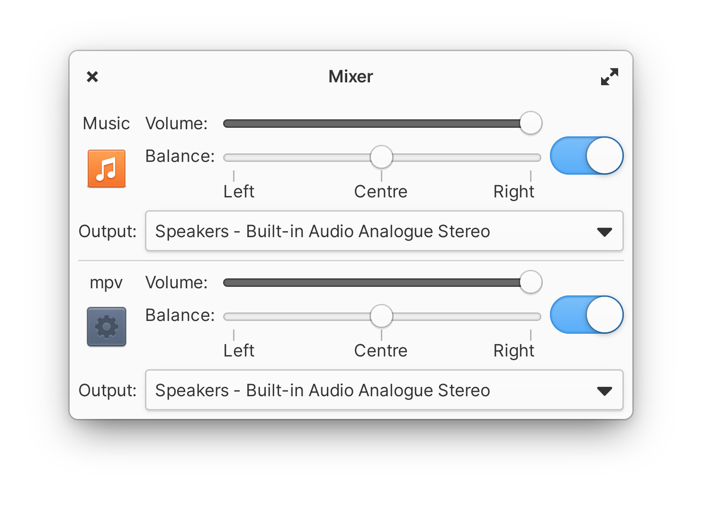
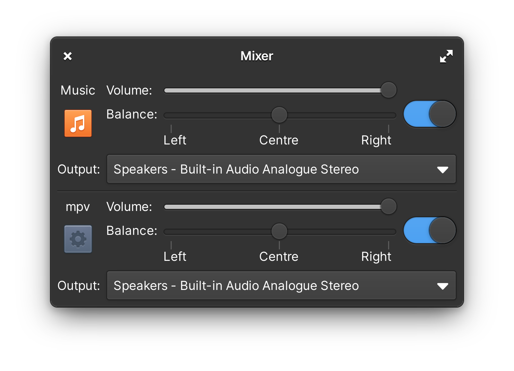

# Mixer
[](#contributors-)
### Change the volume of apps

A no-frills volume mixer, with simplicity and usability at its core.

* Simple volume controls including balance and output selection
* Individually change each audio source's values

<p align="center">

<br>


</p>

# Installing

<a href="https://appcenter.elementary.io/com.github.childishgiant.mixer"></a>
<a href="https://flathub.org/apps/details/com.github.childishgiant.mixer"></a>

Releases are also always available as flatpaks on the [releases page](https://github.com/childishgiant/mixer/releases).

## Nightly builds

Nightly builds are handled by GitHub actions and the latest one can be found on [nightly.link](https://nightly.link/ChildishGiant/mixer/workflows/ci/main/Mixer.zip)
## Install it from source

You can of course download and install this app from source.

### Dependencies

Ensure you have these dependencies installed

* glib-2.0
* granite
* gtk+-3.0
* libhandy-1.0

### Install, build and run

```bash
# install elementary-sdk, meson and ninja
sudo apt install elementary-sdk meson ninja-build libhandy-1-dev
# clone repository
git clone https://github.com/ChildishGiant/mixer mixer
# cd to dir
cd mixer
# run meson
meson build --prefix=/usr
# cd to build, install and run
cd build
sudo ninja install && com.github.childishgiant.mixer
# For debugging use
sudo ninja install && G_MESSAGES_DEBUG=all com.github.childishgiant.mixer
```

### Generating translation files

```bash
# after setting up meson build
cd build

# generates pot file
ninja com.github.childishgiant.mixer-pot
ninja extra-pot

# to regenerate and propagate changes to every po file
ninja com.github.childishgiant.mixer-update-po
ninja extra-update-po
```

## Contributors ✨

Thanks goes to these wonderful people ([emoji key](https://allcontributors.org/docs/en/emoji-key)):

<!-- ALL-CONTRIBUTORS-LIST:START - Do not remove or modify this section -->
<!-- prettier-ignore-start -->
<!-- markdownlint-disable -->
<table>
  <tr>
    <td align="center"><a href="https://github.com/ChildishGiant"><br /><sub><b>Allie</b></sub></a><br /><a href="#design-ChildishGiant" title="Design">🎨</a> <a href="https://github.com/ChildishGiant/mixer/commits?author=ChildishGiant" title="Code">💻</a></td>
    <td align="center"><a href="https://github.com/SubhadeepJasu"><br /><sub><b>Subhadeep Jasu</b></sub></a><br /><a href="https://github.com/ChildishGiant/mixer/commits?author=SubhadeepJasu" title="Code">💻</a></td>
    <td align="center"><a href="https://github.com/JeysonFlores"><br /><sub><b>Jeyson Flores</b></sub></a><br /><a href="#translation-JeysonFlores" title="Translation">🌍</a></td>
    <td align="center"><a href="https://dribbble.com/Suzie97"><br /><sub><b>Rajdeep Singha</b></sub></a><br /><a href="https://github.com/ChildishGiant/mixer/commits?author=Suzie97" title="Code">💻</a></td>
    <td align="center"><a href="https://github.com/asdffdsdaf"><br /><sub><b>asdf</b></sub></a><br /><a href="#translation-asdffdsdaf" title="Translation">🌍</a></td>
    <td align="center"><a href="https://nathanbonnemains.squill.fr"><br /><sub><b>Nathan Bonnemains</b></sub></a><br /><a href="#translation-NathanBnm" title="Translation">🌍</a></td>
  </tr>
</table>

<!-- markdownlint-restore -->
<!-- prettier-ignore-end -->

<!-- ALL-CONTRIBUTORS-LIST:END -->

This project follows the [all-contributors](https://github.com/all-contributors/all-contributors) specification. Contributions of any kind welcome!
