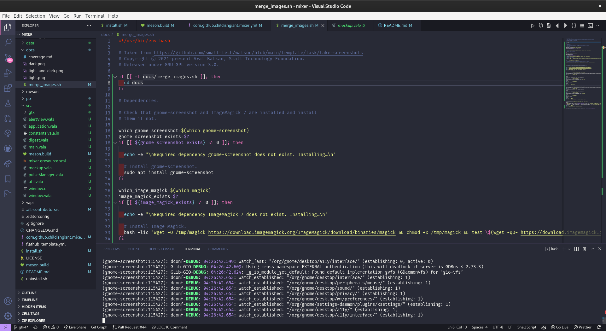

# Mixer
<!-- ALL-CONTRIBUTORS-BADGE:START - Do not remove or modify this section -->
[](#contributors-)
<!-- ALL-CONTRIBUTORS-BADGE:END -->
### Change the volume of apps

A no-frills volume mixer, with simplicity and usability at its core.

* Simple volume controls including balance and output selection
* Individually change each audio source's values

<p align="center">

<br>


</p>

# Installing

You can download the latest release from the [releases page](https://github.com/childishgiant/mixer/releases).


## Get it from the elementary OS AppCenter!

<!-- [](https://appcenter.elementary.io/mixer)

This app is available on the elementary OS AppCenter. -->

Not just yet

## Nightly builds

Nightly builds are handled by GitHub actions and the latest one can be found on [nightly.link](https://nightly.link/ChildishGiant/mixer/workflows/ci/main/Mixer.zip)
## Install it from source

You can of course download and install this app from source.

### Dependencies

Ensure you have these dependencies installed

* granite
* gtk+-3.0

### Install, build and run

```bash
# install elementary-sdk, meson and ninja
sudo apt install elementary-sdk meson ninja
# clone repository
git clone https://github.com/ChildishGiant/mixer mixer
# cd to dir
cd mixer
# run meson
meson build --prefix=/usr
# cd to build, install and run
cd build
sudo ninja install && com.github.childishgiant.mixer
# For debugging use
sudo ninja install && G_MESSAGES_DEBUG=all com.github.childishgiant.mixer
```

### Generating pot file

```bash
# after setting up meson build
cd build

# generates pot file
ninja com.github.childishgiant.mixer-pot

# to regenerate and propagate changes to every po file
ninja com.github.childishgiant.mixer-update-po
```

## Contributors ✨

Thanks goes to these wonderful people ([emoji key](https://allcontributors.org/docs/en/emoji-key)):

<!-- ALL-CONTRIBUTORS-LIST:START - Do not remove or modify this section -->
<!-- prettier-ignore-start -->
<!-- markdownlint-disable -->
<table>
  <tr>
    <td align="center"><a href="https://github.com/JeysonFlores"><br /><sub><b>Jeyson Flores</b></sub></a><br /><a href="#translation-JeysonFlores" title="Translation">🌍</a></td>
  </tr>
</table>

<!-- markdownlint-restore -->
<!-- prettier-ignore-end -->

<!-- ALL-CONTRIBUTORS-LIST:END -->

This project follows the [all-contributors](https://github.com/all-contributors/all-contributors) specification. Contributions of any kind welcome!