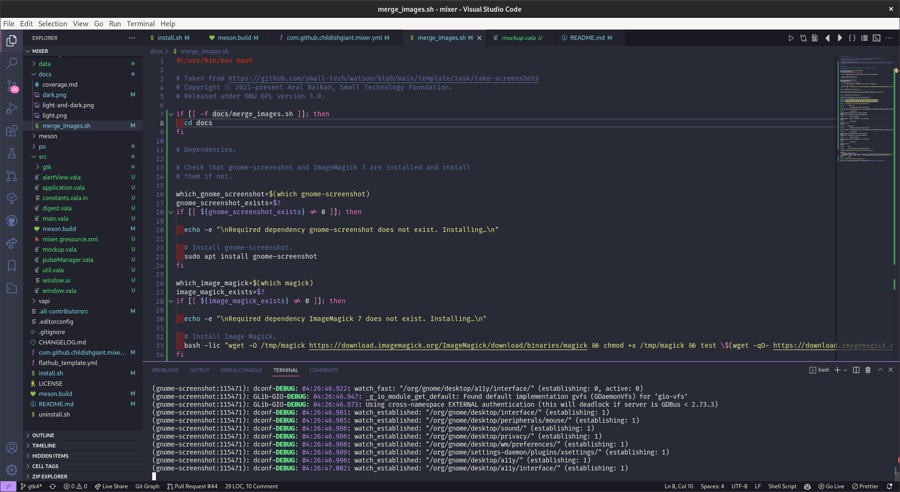

# Mixer

**Mixer is currently in development. Features may be missing and bugs are bound to happen. Proceed with caution.**

A simple volume mixer for Elementary OS!

<p align="center">

<br>


</p>

## Get it from the elementary OS AppCenter!

<!-- [](https://appcenter.elementary.io/mixer)

This app is available on the elementary OS AppCenter. -->

Not just yet

# Install it from source

You can of course download and install this app from source.

## Dependencies

Ensure you have these dependencies installed

* granite
* gtk+-3.0
* switchboard-2.0

## Install, build and run

```bash
# install elementary-sdk, meson and ninja
sudo apt install elementary-sdk meson ninja
# clone repository
git clone https://github.com/ChildishGiant/mixer mixer
# cd to dir
cd mixer
# run meson
meson build --prefix=/usr
# cd to build, install and run
cd build
sudo ninja install && com.github.mixer
```

## Generating pot file

```bash
# after setting up meson build
cd build

# generates pot file
ninja com.github.mixer-pot

# to regenerate and propagate changes to every po file
ninja com.github.mixer-update-po
```
